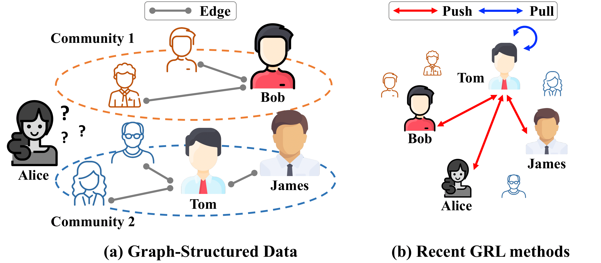

# Relational Self-Supervised Representation Learning on Graphs

The official source code for **Relational Self-Supervised Representation Learning on Graphs** paper, accepted at CIKM 2022.


### Overview
Over the past few years, graph representation learning (GRL) has been a powerful strategy for analyzing graph-structured data. 
Recently, GRL methods have shown promising results by adopting self-supervised learning methods developed for learning representations of images. Despite their success, existing GRL methods tend to overlook an inherent distinction between images and graphs, i.e., images are assumed to be independently and identically distributed, whereas graphs exhibit relational information among data instances, i.e., nodes.
To fully benefit from the relational information inherent in the graph-structured data,
we propose a novel GRL method, called **RGRL**, that learns from the relational information generated from the graph itself. 
**RGRL** learns node representations such that the relationship among nodes is invariant to augmentations, i.e., *augmentation-invariant relationship*, which allows the node representations to vary as long as the relationship among the nodes is preserved.
By considering the relationship among nodes in both global and local perspectives, **RGRL** overcomes limitations of previous contrastive and non-contrastive methods, and achieves the best of both worlds. 
Extensive experiments on fourteen benchmark datasets over various downstream tasks demonstrate the superiority of **RGRL** over state-of-the-art baselines.

**Keep in mind: Graph-structured data exhibit the relational information among the nodes!**

</img> 


### Requirements

- Python version: 3.7.10
- Pytorch version: 1.8.1
- torch-geometric version: 1.7.0

### Hyperparameters
Following Options can be passed to `main.py`

`--dataset:`
Name of the dataset. Supported names are: wikics, computers, photo, cs, physics, cora, citeseer, pubmed, and CoraFull.  
usage example :`--dataset wikics`

`--lr:`
Learning rate for training the model.  
usage example :`--lr 0.001`

`--epochs:`
Number of epochs for training the model.  
usage example :`--epochs 5000`

`--aug_params:`
Hyperparameters for augmentation (p_f1, p_f2, p_e1, p_e2).  
usage example :`--aug_params 0.3 0.4 0.3 0.2`

`--layers:`
The number of units of each layer of the GNN.  
usage example :`--layers 512 256`

`--pred_hid:`
The number of hidden units of layer of the predictor.  
usage example :`--pred_hid 512`

`--sample:`
The number of global anchor nodes.  
usage example :`--sample 1024`

`--topk:`
The number of local anchor nodes.  
usage example :`--topk 4`

`--temp_t:`
Global temperature for target network.  
usage example :`--temp_t 0.01`

`--temp_t_diff:`
local temperature for target network.  
usage example :`--temp_t_diff 1.0`

`--alpha:`
Hyperparameters for the skewness of inverse degree sampling distribution.  
usage example :`--alpha 0.9`

`--beta:`
Hyperparameters for the minimum weight of inverse degree sampling distribution.  
usage example :`--beta 0.0`

`--lam:`
Hyperparameters for the weight of local loss.  
usage example :`--lam 1.0`


### How to Run

You can run the model with following options
- To run node classification (reproduce Table 1 and 2 in paper)
```
cd sh
sh run_RGRL.sh
```

- or you can run the file with above mentioned hyperparameters
```
python main.py --device 0 --embedder RGRL --layers 512 256 --pred_hid 512 --lr 0.001 --epochs 1500 --sample 2048 --topk 2 --dataset wikics --aug_params 0.2 0.1 0.2 0.3 --temp_t 0.05 --temp_t_diff 1.0 --alpha 0.99 --beta 0.01 --lam 1.0 --eval_freq 5
```

### Reproducibility
We uploaded RGRL's learned embeddings in `embeddings` folder.  
Please check `reproduce.ipynb` file for details.